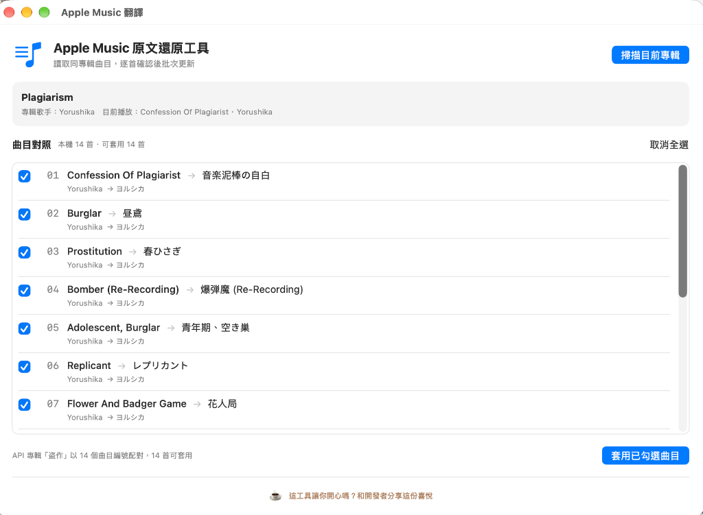

# 🎵 Apple Music 原文歌名還原工具 (Apple Music Localizer)

  
   
  <b>告別被強制翻譯的羅馬音，一鍵找回 Apple Music 歌曲的原始日文歌名。</b>
   
  
  
  
  

---

## 💡 為什麼需要這個工具？

身為在台灣或其他海外地區使用 Apple Music 的 J-POP 愛好者，你是否常遇到這種令人崩潰的情況：
* 想聽 **ヨルシカ** 的《春ひさぎ》，歌名卻被強制顯示為 **《Prostitution》**；
* 《昼鳶》被翻成 **《Burglar》**，明明聽得滾瓜爛熟，但看著英文歌名在猜歌大賽裡完全想不起日文原名；
* Ado 的《唱》變成了 **《Show》**⋯⋯

**Apple Music Localizer** 是一個輕量、原生且完全免費的 macOS 工具。只需播放歌曲並點擊一次按鈕，它就能自動向 Apple 官方 iTunes 原文資料庫比對整張專輯曲目，讓你的音樂資料庫恢復原本優美雅緻的原創樣貌。

---

## 📸 功能預覽

  
   
  <i>自動抓取同專輯所有曲目，清晰比對目前英文名稱與建議日文原文，支援多選與批次套用。</i>

---

## ✨ 主要特色

- **整張專輯批次掃描**：播放歌曲後點擊掃描，自動抓取本機資料庫中同專輯所有曲目。
- **高精準度多維比對演算法**：
  - 結合**曲目編號、碟片編號與播放秒數 (Duration)** 多重比對，徹底解決先行單曲軌號衝突或位移問題。
  - 導入**藝人相關性與時長加權**，避免跨語言搜尋雜訊。
- **自選與預覽機制**：修改前提供完整對照清單，可個別勾選或一鍵全選，確認無誤才寫入。
- **安全防護 (一鍵 Undo)**：修改前自動備份原始曲目資訊，若有誤判可一鍵完整還原。
- **macOS 原生打造**：採用 Swift / SwiftUI 開發，輕巧流暢，無任何臃腫的依賴套件。

---

## 🚀 下載與使用教學

### 1. 下載軟體
前往 [Releases 頁面](https://github.com/sudotinycraft-coder/apple-music-localizer/releases/latest)，下載最新版的 `AppleMusicLocalizer-vX.X.X-macos.zip`。

### 2. 安裝與執行
1. 解壓縮下載的檔案，將 `AppleMusicLocalizer.app` 拖曳至系統的 **「應用程式 (Applications)」** 資料夾。
2. 打開 Mac 內建的 **「音樂 (Music.app)」** 並播放任一首歌曲。
3. 開啟本軟體，點擊右上角 **「掃描目前專輯」**。
4. 勾選你想還原的曲目，點擊右下角 **「套用已勾選曲目」** 即可完成！

> ⚠️ **首次開啟常見問題**：
> 1. **安全性提示**：首次點擊掃描時，macOS 會詢問是否允許控制「音樂」，請務必點擊 **「好 (OK)」** 以獲得修改歌名的權限。
> 2. **無法打開 App 提示**：若系統提示「無法打開，因為它來自未識別的開發者」，請至 Mac 的 **「系統設定」➔「隱私權與安全性」**，滾動至最下方點擊 **「強制打開」** 即可。

---

## 🗺️ 開發路線圖 (Roadmap)

- [x] 單曲讀取與 iTunes API 比對
- [x] 整張專輯批次掃描與對照
- [x] 多維度時長智慧對齊演算法
- [x] 專屬 macOS App Icon 設計
- [ ] 韓文歌曲 (K-POP) 原名比對與國家地區切換選單
- [ ] 整個播放清單 (Playlist) 批次掃描

---

## ☕️ 支持開發者

如果這個小工具拯救了你的 Apple Music 音樂庫，為你省下手動修改歌名的繁瑣時間，歡迎請小島民喝杯咖啡，和我們分享這份喜悅：

  

---

## ⚖️ 授權與免責聲明 (License & Disclaimer)

* 本專案依據 [MIT License](LICENSE) 條款開源釋出。
* **非官方聲明**：本工具為獨立開源專案，與 Apple Inc. 無任何官方隸屬、贊助或背書關係。Apple、Apple Music、macOS 及 iTunes 均為 Apple Inc. 之商標。
* **資料安全**：本工具僅透過系統公開之 AppleScript 讀寫本地資料庫標籤（Metadata），不會變更或刪除原始音訊檔案。軟體提供復原機制，惟使用者仍應自行承擔使用風險。
