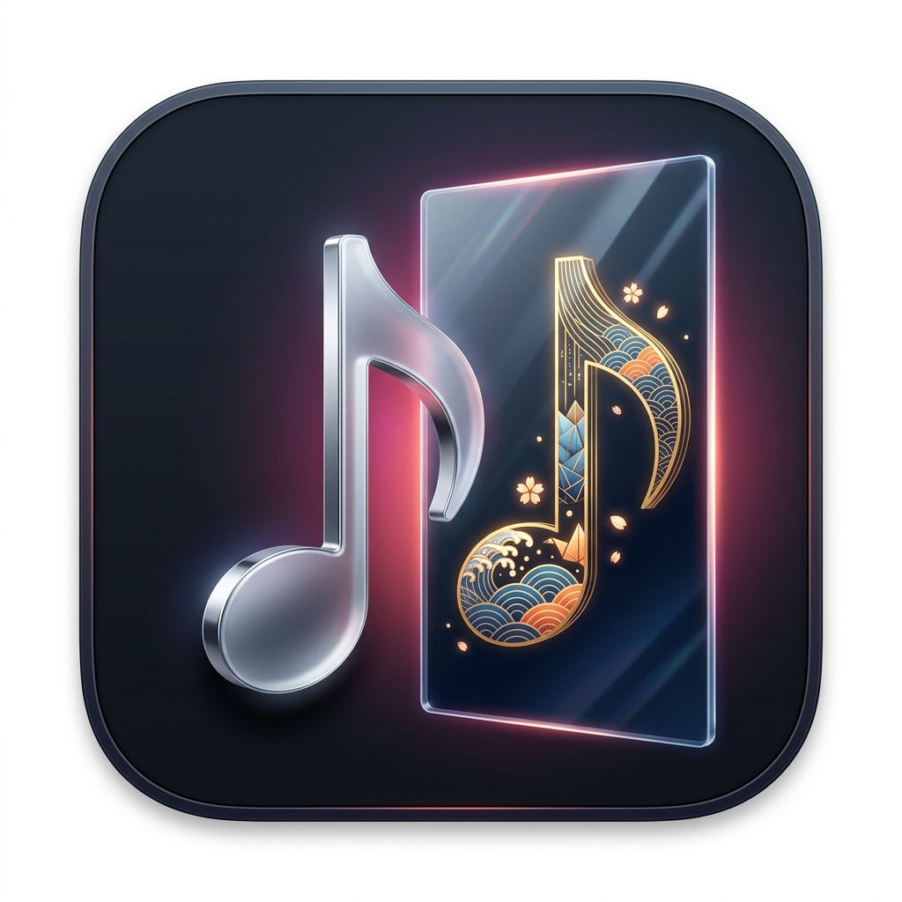

# 視覺與圖示設計規範 (Icon & Visual Design)

本文件記錄「Apple Music 原文歌名還原工具」的 macOS 應用程式圖示 (App Icon) 之核心設計隱喻、構圖概念與檔案規範。

---

## 1. 核心設計隱喻 (Metaphor)

* **「鏡面映射與還原」**：
  在 Apple Music 非發行地區（如台灣或海外），歌曲名稱常被強制轉譯為英文羅馬拼音或無文化特徵之翻譯。
  圖示藉由「鏡子前後是不同東西」的直觀隱喻，表達**「鏡子前是標準化的外顯標籤，鏡中映照出歌曲原生的文化靈魂與原創風貌」**。

---

## 2. 元素構成解析 (Visual Elements)

1. **鏡前音符 (The Foreground Note)**：
   * **造形**：極簡俐落的 3D 八分音符（♪）。
   * **質地**：消光霧面金屬與微鉻銀（Frosted Metal & Chrome），象徵工業化、標準化、無個別文化特徵的國際版羅馬字/英文標記。
2. **折射鏡面 (The Refraction Pane)**：
   * **造形**：矗立於畫面中央偏右的半透明厚玻璃面。
   * **光影**：具備邊緣微光與稜鏡折射（Prism Flare），作為「轉換與還原」的中介界線。
3. **鏡中原貌 (The Reflected Soul)**：
   * **紋理**：鏡中的音符內部被還原為精緻的東方傳統浮世繪波浪紋（青海波/和柄）、折扇折線與細膩的金箔描邊。
   * **點綴**：飄落的櫻花花瓣倒影，強化文化原生性與藝術感。
4. **背景與底座 (Base & Atmosphere)**：
   * **基座**：遵循 Apple macOS Human Interface Guidelines (HIG) 的 Squircle 圓角矩形容器。
   * **氛圍光**：深色午夜藍黑霧面基底，襯托出象徵 Apple Music 的品紅（Magenta）與珊瑚橘（Coral）背光。

---

## 3. 語意擴充性 (Scalability)

* 本設計刻意採用「文化紋理與藝術線條」取代單一特定的語言字元（如日文あ或韓文아）。
* 此視覺符號具備高通用性，在未來版本支援日文、韓文、乃至其他亞洲語系時，皆能維持「還原原創風貌」之精神，無需反覆更換 Logo。

---

## 4. 資源規格與檔案目錄 (Assets)

| 檔案路徑 | 格式 | 用途 |
|---|---|---|
| `docs/design/app_icon.png` | PNG (1024x1024) | 高解析度概念展示原圖 |
| `AppleMusicLocalizer/Resources/AppIcon.png` | PNG (1024x1024) | 專案原始圖示資源 |
| `AppleMusicLocalizer/Resources/AppIcon.icns` | macOS ICNS (16x16 ~ 1024x1024) | 打包腳本 (`build_app.sh`) 所需之原生 App 圖示檔 |
